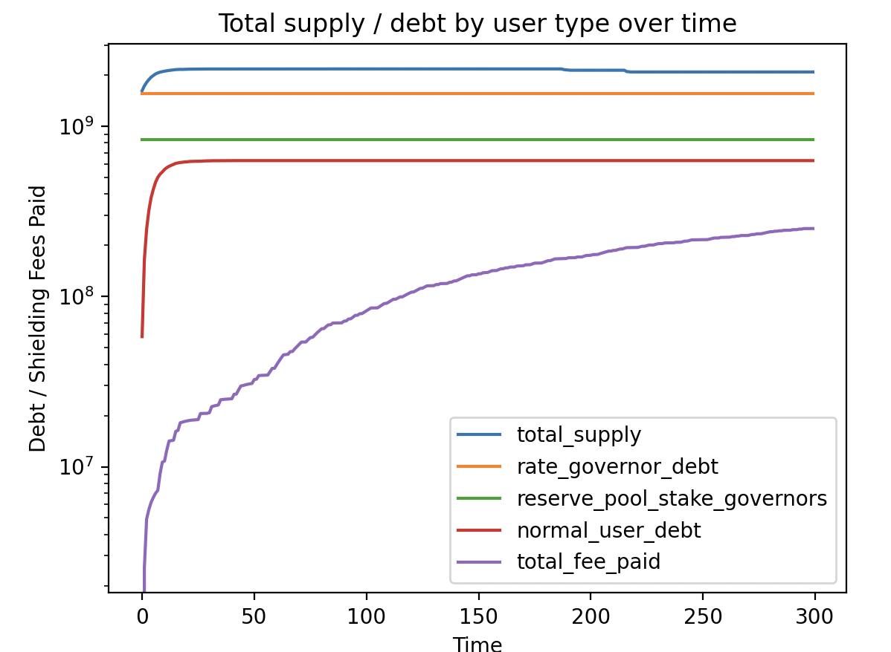
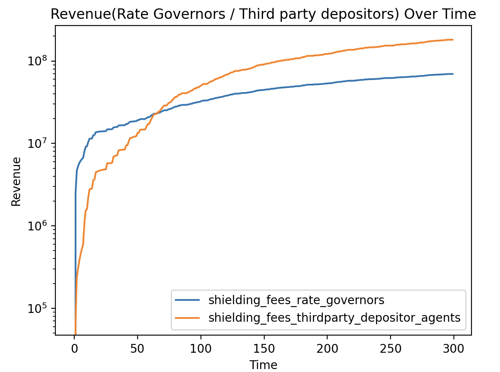
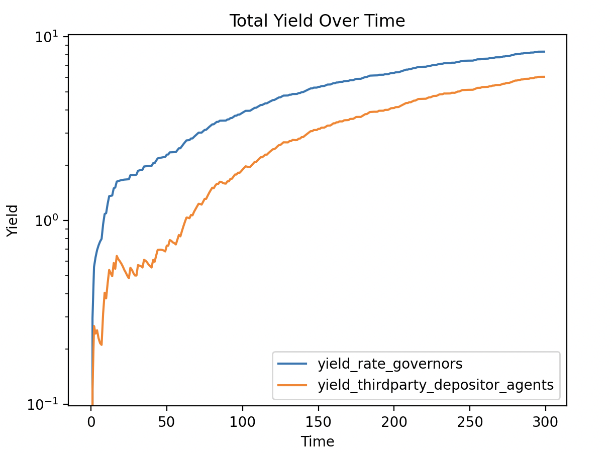

# Agent based simulation

## Goals

1. Understand what is going to be the yield for rate governors.
2. Understand what is going to be the yield for reserve pool depositors.

## Initial Results

**Simulation Setup**

### Rate governor not paying any fee

- Rate Governors: 500, collateral size: 10-200
- Normal Users: 4000, collateral size: 0.3 - 10
- Third party pool depositors: 2000

Liquidations / Redemptions are not considered

### Rate governor's paying a fee

- Rate Governors: 500, collateral size: 10-200
- Normal Users: 4000, collateral size: 0.3 - 10
- Third party pool depositors: 2000

Liquidations / Redemptions are not considered

